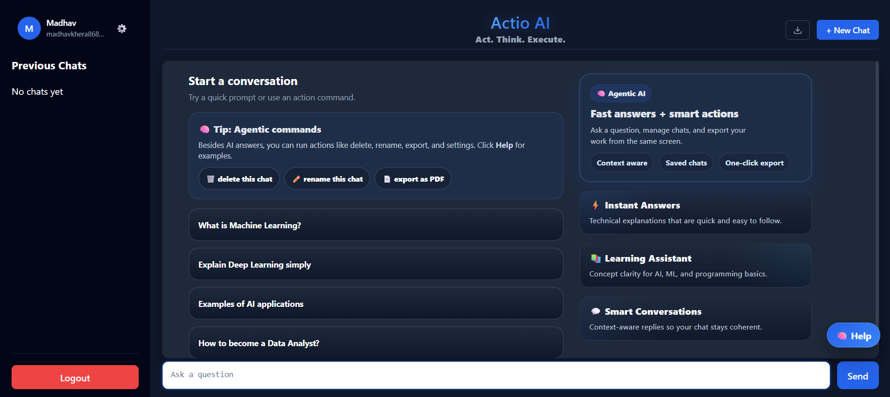
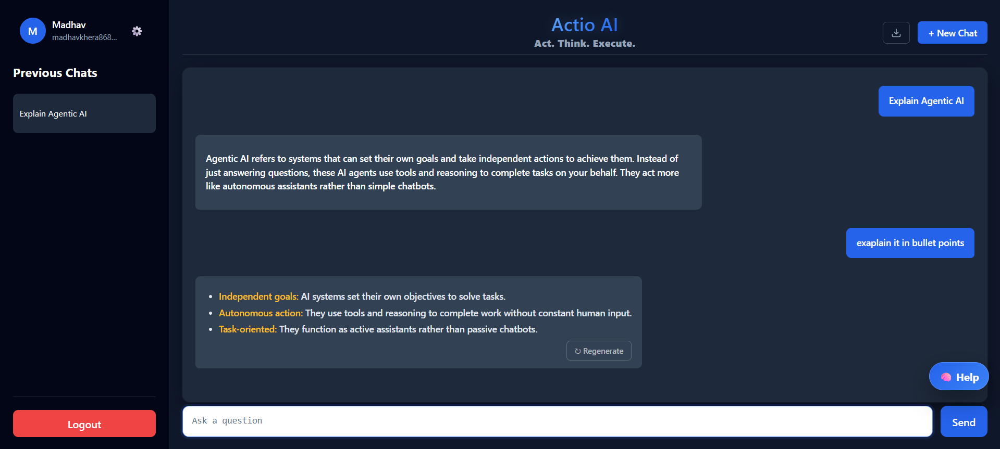
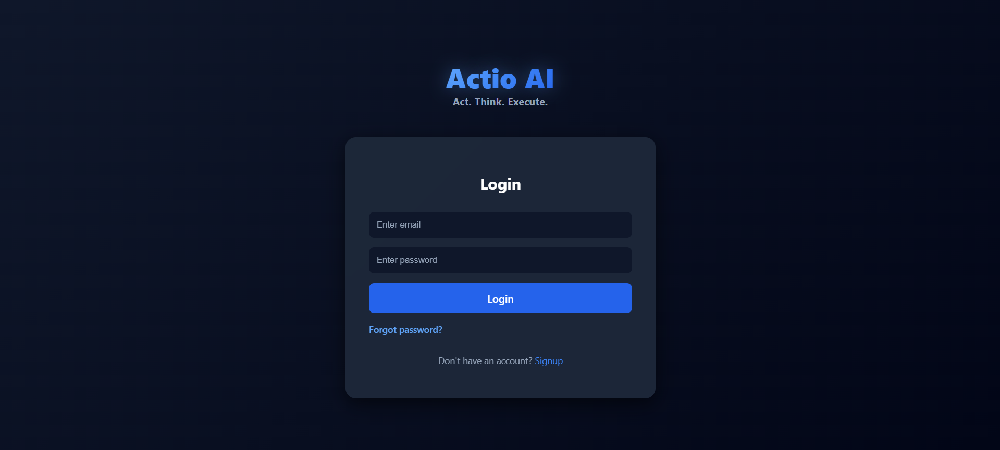
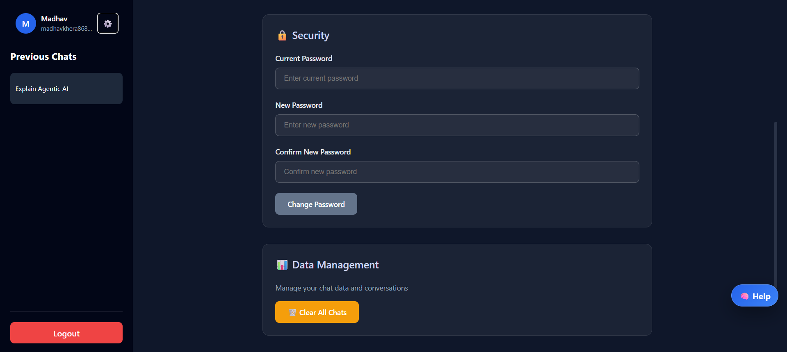
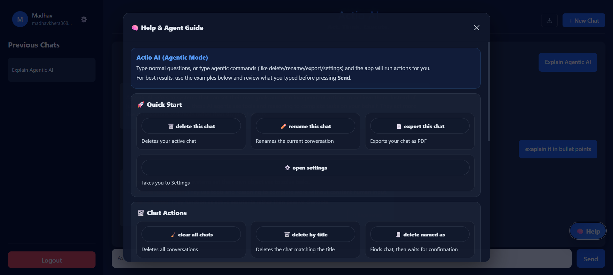

# Actio AI
AI that acts, not just responds.

Actio AI is a full-stack AI support assistant built with React, Node.js, Express, and MongoDB.

It started as a chatbot project, but the goal was to make it more useful than a basic prompt box. Along with AI responses, the app supports agent-style actions such as renaming chats, deleting chats, exporting conversations, opening settings, and handling account-related flows like password reset.

The system follows a simple agent-like flow:
**User input -> intent detection -> decision -> AI response or action execution**

## 🚀 Live Demo

- Frontend: [https://actio-ai.vercel.app](https://actio-ai.vercel.app)
- Backend: [https://actio-ai-backend.onrender.com](https://actio-ai-backend.onrender.com)

## 🖼️ Screenshots

### 🏠 Home


### 💬 Chat


### 🔐 Login


### 📝 Signup


### 🔑 Forgot Password


### ⚙️ Settings


### 🧠 Help Guide


## ✨ Features/What it does

- User signup and login with JWT authentication
- Persistent chat history per user
- Natural-language chat actions such as:
  - start a new chat
  - rename a chat
  - delete a chat
  - clear all chats
  - export chat as text or PDF
  - open settings
  - regenerate the last response
- Password reset flow with email support
- Profile update and password change
- Chat export in `.txt` and `.pdf`
- Markdown rendering for AI responses
- FAQ fallback before calling the AI model

## 🛠️ Tech Stack

**Frontend**
- React
- Vite
- Axios
- React Markdown
- jsPDF

**Backend**
- Node.js
- Express
- MongoDB + Mongoose
- JWT
- bcrypt

**AI / Services**
- Gemini API
- Resend for password reset emails

**Deployment**
- Vercel for frontend
- Render for backend
- MongoDB Atlas for database

## 📁 Project Structure

```text
actio-ai/
  backend/
    config/
    middleware/
    models/
    routes/
    services/
    server.js

  frontend/
    src/
      components/
      pages/
      App.jsx
      main.jsx
```

## 💻 Running it locally

### 1. Clone the repository

```bash
git clone https://github.com/your-username/actio-ai.git
cd actio-ai
```

### 2. Backend setup

```bash
cd backend
npm install
```

Create a `.env` file inside `backend/` using `backend/.env.example`.

Start the backend:

```bash
npm run dev
```

### 3. Frontend setup

Open a new terminal:

```bash
cd frontend
npm install
```

Create a `.env` file inside `frontend/` using `frontend/.env.example`.

Start the frontend:

```bash
npm run dev
```

## 🔐 Environment variables

### Backend

```env
PORT=5000
MONGO_URI=your_mongodb_connection_string
JWT_SECRET=your_jwt_secret
GEMINI_API_KEY=your_gemini_api_key
FRONTEND_URL=http://localhost:5173
RESEND_API_KEY=your_resend_api_key
EMAIL_FROM=onboarding@resend.dev
```

### Frontend

```env
VITE_API_BASE_URL=http://localhost:5000
```

## 🧩 A few implementation notes

- The frontend uses environment-based API configuration, so local and deployed setups can use different backend URLs cleanly.
- Password reset email delivery is handled through Resend because free Render services do not support outbound SMTP traffic reliably.
- The app includes an agentic command layer on top of the chat UI, so some user messages trigger actions instead of normal AI replies.

## 🎯 Why this project

The goal was to explore how AI systems can move beyond answering questions and start interacting with real application logic through simple agent-like behavior.

## 📌 Current status

The project is deployed and working end-to-end with the following capabilities:

- signup / login with authentication  
- AI chat with persistent conversations  
- agentic command handling (intent-based actions like rename, delete, export, etc.)  
- previous conversations and chat history  
- password reset via email  
- settings and account management  

The system can interpret certain user inputs as actions instead of just queries, making it behave like a simple AI agent rather than a standard chatbot.

**RAG / document-based retrieval is planned as a future improvement.**
